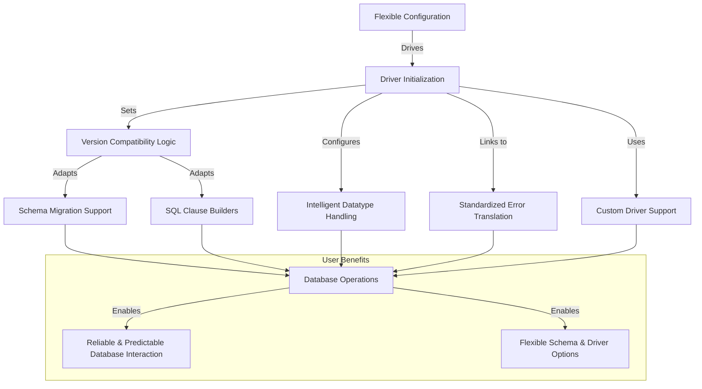

# Feature Highlights

The GORM MySQL Driver delivers a comprehensive set of capabilities designed to make connecting and interacting with MySQL databases seamless, efficient, and adaptable for Go developers. This page offers a concise overview of the driver's core features, emphasizing their practical benefits so you can quickly understand what it brings to your projects.

---

## Key Features & Capabilities

### 1. Flexible Configuration
Configure your MySQL connection with ease and precision. The driver supports detailed settings such as:
- **Data Source Name (DSN) Support:** Define host, port, credentials, charset, and other standard MySQL connection options.
- **Default String Size:** Automatically control default string field sizes to optimize storage and indexing.
- **Datetime Precision Management:** Enable or disable datetime precision support based on your MySQL version.
- **Version-Aware Behavior:** Automatically adapts features like index renaming, column renaming, and constraint dropping based on the specific MySQL, MariaDB, or TiDB server version detected.

*Example:*
```go
db, err := gorm.Open(mysql.New(mysql.Config{
  DSN: "gorm:gorm@tcp(localhost:9910)/gorm?charset=utf8&parseTime=True&loc=Local",
  DefaultStringSize: 256,
  DisableDatetimePrecision: true,
  DontSupportRenameIndex: true,
}), &gorm.Config{})
```

### 2. Robust Datatype Handling
The driver intelligently maps Go types to MySQL column types, ensuring your schema matches your intention and database capabilities:
- **Integer Ranges:** Maps integer sizes from tinyint up to bigint with support for unsigned integers.
- **String Types:** Differentiates between varchar, mediumtext, and longtext based on length requirements.
- **Datetime Types:** Supports precise datetime formatting with configurable precision catering to MySQL 5.6+ and disables it gracefully for older versions.
- **Auto-random Support:** Recognizes and properly marks `auto_random()` primary keys for TiDB compatibility.

### 3. Version Compatibility and Adaptability
The driver detects and adapts to differences in MySQL, MariaDB, and TiDB versions, automatically handling features such as:
- **Renaming Indexes and Columns:** Uses fallback operations where native features aren't supported.
- **WITH RETURNING Clause:** Enables or disables use based on server version.
- **Constraint Management:** Safely adds or drops constraints with fallbacks tailored for database quirks.

### 4. Custom Driver Support
Extend or replace the underlying MySQL driver easily to suit custom needs or alternative MySQL-compatible systems:
- Specify a custom driver by name in the configuration.
- Full compatibility with all GORM features while using your driver.

*Example:*
```go
import (
  _ "example.com/my_mysql_driver"
  "gorm.io/gorm"
  "gorm.io/driver/mysql"
)

db, err := gorm.Open(mysql.New(mysql.Config{
  DriverName: "my_mysql_driver_name",
  DSN: "gorm:gorm@tcp(localhost:9910)/gorm?charset=utf8&parseTime=True&loc=Local",
}), &gorm.Config{})
```

### 5. Comprehensive Schema Migration Support
Through the integrated `Migrator`:
- Migrate column data types accurately with comments.
- Rename columns and indexes with intelligent compatibility handling.
- Add, alter, drop columns and constraints while managing foreign keys sensitively.
- Fetch column types and indexes from the database for reflection and validation.

### 6. Intuitive SQL Clause Builders
Handles MySQL-specific SQL clauses like `ON DUPLICATE KEY UPDATE` and adapts locking clauses to match server capabilities.

### 7. Precise Error Translation
Seamlessly translates MySQL driver errors into GORM standardized errors, allowing you to handle database errors consistently:
- Duplicate key errors map to `gorm.ErrDuplicatedKey`.
- Foreign key violations map to `gorm.ErrForeignKeyViolated`.

---

## Why Feature Highlights Matter to You
Understanding these features lets you immediately leverage the driver's power without surprises. Whether you are:
- Building a new application with GORM and MySQL,
- Migrating schemas automatically,
- Customizing behavior for specific MySQL versions or forks like TiDB,
- Or integrating a tailored MySQL driver,

this page clarifies the capabilities available to streamline your development process.

---

## Real-World Example: Connecting with Customizable Precision
Consider a logging application that requires timestamps down to milliseconds and sizable text fields. With this driver, you can configure datetime precision and string sizes upfront to optimize how your schema translates to MySQL:

```go
var precision = 3

db, err := gorm.Open(mysql.New(mysql.Config{
  DSN: "user:pass@tcp(localhost:3306)/logs?charset=utf8mb4&parseTime=True&loc=Local",
  DefaultStringSize: 512,
  DefaultDatetimePrecision: &precision,
}), &gorm.Config{})
```

This ensures timestamps retain desired granularity and text fields avoid unexpected default sizes, reducing migration headaches and runtime surprises.

---

## Next Steps
To put these features into action, explore:
- [Basic Configuration](../getting-started/configuration-first-run/basic-configuration) to learn how to set up your driver.
- [First Database Connection](../getting-started/configuration-first-run/first-connection) which walks you through establishing your initial database connection.
- [Using a Customized MySQL Driver](../getting-started/configuration-first-run/custom-driver-usage) if your project demands specialized driver behavior.

---

For further architectural and integration insights, see the [System Architecture Overview](./system-architecture-overview) and [Integration & Compatibility](./integration-and-compatibility) pages.

---


---

## Diagram: Feature Interaction Overview


