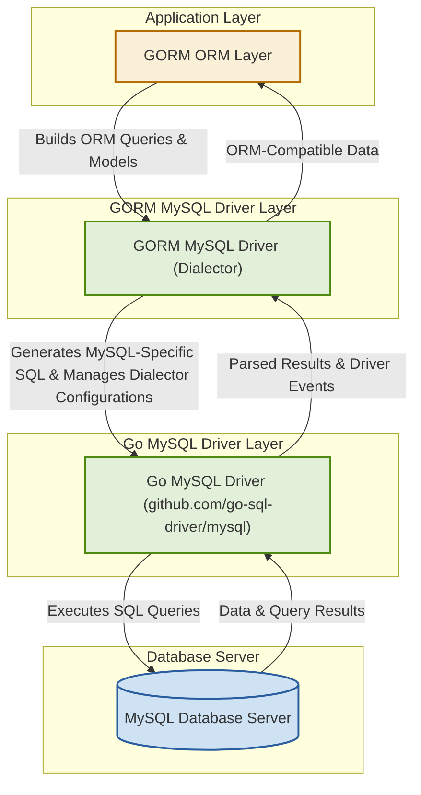

# System Architecture Overview

## Visualizing the GORM MySQL Driver within the GORM Architecture

To effectively integrate MySQL into Go applications through GORM, understanding how the GORM MySQL Driver fits within the overall GORM architecture is essential. This page provides a clear visualization of the driver’s role, the core components it interacts with, and the typical data flow during database operations.

### Why This Matters

Developers working with GORM and MySQL can benefit greatly by seeing how components communicate under the hood. This understanding empowers efficient debugging, smarter customization, and harnessing the full power of GORM’s features with MySQL.

---

## Core Components Involved

- **GORM ORM Layer:** The main abstraction where developers define models, queries, and transactions.
- **GORM MySQL Driver (Dialector):** The MySQL-specific adapter that translates GORM’s generic calls to MySQL-compatible SQL and manages MySQL server nuances.
- **Go MySQL Driver (`github.com/go-sql-driver/mysql`):** The underlying native Go driver handling actual connection, query execution, and result retrieval from MySQL servers.
- **MySQL Database Server:** The backend relational database engine.

## Typical Data Flow

1. **User Calls GORM API:** Developers interact with GORM’s ORM methods in their Go code.
2. **GORM Constructs SQL:** Using schema and clause builders, GORM prepares SQL commands.
3. **MySQL Driver Customize SQL:** The MySQL Dialector modifies SQL clauses to match MySQL syntax and compatibility.
4. **Go MySQL Driver Executes Query:** The SQL statement is passed to the native Go MySQL driver.
5. **MySQL Server Processes Query:** The query executes against the MySQL server.
6. **Results Returned and Translated:** Results traverse back through the Go MySQL driver and Dialector to GORM.
7. **Users Receive ORM Results:** Developers work with Go structs populated by GORM.

## Architecture Diagram

## Key Integration Points

- **Version Detection:** Upon initializing, the MySQL Dialector queries the MySQL server version to adjust SQL syntax and feature usage dynamically (e.g., `RENAME INDEX` support or datetime precision).
- **Clause Builders:** The Dialector customizes SQL clause generation specific to MySQL dialect needs like `ON DUPLICATE KEY UPDATE` for upsert behavior.
- **Error Translation:** MySQL driver errors are mapped to standardized GORM error types for consistent application-level error handling.
- **Connection Pooling:** The Dialector can use either a custom connection pool or the standard `database/sql` pool provided by Go’s SQL package.

## Practical Example: How This Works During `Create` Operations

Suppose you call `db.Create(&user)` using GORM with the MySQL Dialector:

- GORM prepares an `INSERT` statement.
- The MySQL Dialector modifies the clause to use MySQL’s `ON DUPLICATE KEY UPDATE` if needed.
- The Go MySQL Driver manages socket communication with the database sending the query.
- The MySQL server executes and returns the result.
- The driver relays any result or errors back.
- The Dialector converts MySQL-specific errors into GORM errors (e.g., duplicate key error to `ErrDuplicatedKey`).
- GORM updates the Go structs and returns control to your application.

## How Understanding This Architecture Helps You

- **Debugging:** Quickly locate where a failure or unexpected behavior may occur — in GORM query construction, Dialector syntax conversion, driver transmission, or database server.
- **Customization:** Knowing this flow allows advanced users to create customized drivers or interceptors at the Dialector or driver layers.
- **Performance Tuning:** Awareness of connection pooling and version-specific features helps optimize your database interactions.
- **Error Handling:** Understanding the error translation process lets you gracefully handle MySQL-specific error codes in your Go application logic.

## Next Steps

- Explore **[Feature Highlights](/overview/features-architecture-integration/feature-highlights)** to learn the MySQL Driver’s capabilities at a glance.
- Proceed to **[Integration & Compatibility](/overview/features-architecture-integration/integration-and-compatibility)** to see supported MySQL versions and Go driver customizations.
- Set up and start using the driver via the **Getting Started** guides, beginning with **[Prerequisites](/getting-started/prerequisites-installation/prerequisites)**.

---

<Tip>
Visualizing the system architecture improves your ability to troubleshoot complex issues and enables deeper customization for your GORM-MySQL integration.
</Tip>

<Note>
This diagram and page focus exclusively on the driver's role within GORM architecture — for detailed API usage or configuration, refer to the Getting Started and Core Concepts pages.
</Note>
