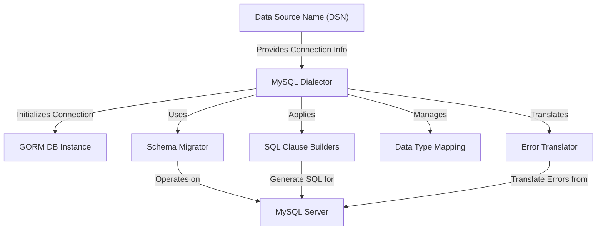

# Core Concepts & Terminology

Understanding the essential terms and configuration options of the GORM MySQL Driver empowers you to effectively tailor your application's database interactions. This page defines foundational concepts such as DSN, Migrator, Datetime Precision, and Driver Customization, offering clarity on how key settings influence behavior, compatibility, and performance.

---

## Data Source Name (DSN)

**What it is:** The DSN is a formatted string specifying how your application connects to the MySQL database. It includes credentials, server address, database name, and connection parameters.

**Why it matters:** Proper configuration of the DSN ensures successful connection establishment and controls behavior such as character encoding and time parsing.

**Example DSN:**

```go
"gorm:gorm@tcp(localhost:9910)/gorm?charset=utf8&parseTime=True&loc=Local"
```

This string connects using username `gorm` to the database `gorm` on localhost port 9910, with UTF-8 encoding, time parsing enabled, and location set to local.

**Tip:** You can parse and manipulate your DSN using the built-in parsing functions before passing it to the driver.

---

## Migrator

**What it is:** The Migrator is a key component responsible for managing your database schema. It enables seamless schema changes like creating tables, adding or renaming columns, and managing indexes and constraints.

**Core purpose:** It abstracts complex SQL migration commands to provide a user-friendly interface for schema evolution.

**Key capabilities:**
- Adding or altering columns with precise data type mapping
- Renaming columns and indexes, according to MySQL or MariaDB version support
- Managing unique constraints and indexes intelligently
- Dropping constraints while handling database compatibility nuances

**Real-world usage:** When evolving your Go application's models, the Migrator ensures the underlying MySQL schema remains in sync without manual intervention.

<Callout>
**Best Practice:** Always verify that your MySQL or MariaDB server supports specific operations like renaming indexes or dropping constraints before running migration commands to avoid unsupported errors.
</Callout>

---

## Datetime Precision

**Concept:** Datetime precision specifies the fractional seconds precision for datetime columns.

**Why it counts:** By default, MySQL 5.6+ supports datetime precision up to microseconds; your driver can specify a default precision to control this behavior, balancing storage size and temporal accuracy.

**Driver behavior:**
- If precision is not explicitly set, it defaults to 3 (milliseconds).
- Optionally, precision support can be disabled to maintain compatibility with older MySQL versions, such as MySQL 5.5 or below.

**Example configuration:**

```go
var datetimePrecision = 2

db, err := gorm.Open(mysql.New(mysql.Config{
  DSN: "...",
  DefaultDatetimePrecision: &datetimePrecision,
  DisableDatetimePrecision: false,
}), &gorm.Config{})
```

This sets default datetime precision to 2 digits (hundredths of a second).

<Info>
Disabling datetime precision improves compatibility with older servers but sacrifices precise timestamp accuracy.
</Info>

---

## Driver Customization & Compatibility

**Custom Driver Names:** You can specify a custom MySQL driver to support specialized connection behaviors or extended features.

**How to** customize:
```go
db, err := gorm.Open(mysql.New(mysql.Config{
  DriverName: "my_mysql_driver_name",
  DSN: "...",
}), &gorm.Config{})
```

**Version awareness:** The driver probes the MySQL/MariaDB/TiDB version to adapt features like:
- Renaming indexes or columns
- Use of `RETURNING` clauses
- Handling special constraints or behaviors

This dynamic adaptability avoids runtime errors and improves migration and query fidelity.

---

## Key Configuration Options Explained

- `DefaultStringSize`: Sets default size for `string` fields. By default, strings without explicit sizes might use types like `longtext`; configuring this to reasonable values (e.g., 256) can improve index compatibility.

- `DisableWithReturning`: Disables `RETURNING` clauses in SQL operations (enabled by default for supported server versions).

- `DontSupportRenameIndex` / `DontSupportRenameColumn`: Flags to handle backend server versions that lack native support for renaming indexes or columns, triggering workarounds such as drop-and-create.

- `SkipInitializeWithVersion`: Disables automatic server version detection on initialization, useful for environments where querying version is restricted.

- `DSNConfig`: Structured DSN parsed configuration, allows programmatic DSN manipulation.

---

## Understanding Clause Builders

The driver customizes how certain SQL clauses are generated to meet MySQL's expectations:

- `ON CONFLICT` is transformed into `ON DUPLICATE KEY UPDATE` for MySQL's upsert semantics.

- `VALUES()` clauses are handled for compatibility.

- `FOR SHARE` locking clauses are rewritten to `LOCK IN SHARE MODE` if the backend doesn't support standard syntax.

This flexibility ensures your GORM code translates into valid, optimized MySQL queries.

---

## Schema Data Types Mapping

The driver maps Go struct fields (`schema.Field`) to MySQL data types accurately:

- Integer types (`int`, `uint`) map to appropriate sizes like `tinyint`, `smallint`, `int`, or `bigint` with `UNSIGNED` and `AUTO_INCREMENT` flags.

- Floating points support precision and scale with `decimal(x, y)`, fallback to `float` or `double`.

- Strings without sizes default to `varchar` with configurable defaults, or `mediumtext` / `longtext` for large sizes.

- Times map with optional precision for datetime types.

- Binary data maps to `varbinary`, `mediumblob`, or `longblob` depending on size.

- Custom data types are supported with preservation of auto-increment where applicable.

<Callout>
Always specify size and precision explicitly in your model tags for predictable schema generation.
</Callout>

---

## Error Code Translation

The driver improves error handling by translating native MySQL error codes into GORM's standardized error types:

| MySQL Error Code | Meaning                     | GORM Translated Error         |
|------------------|-----------------------------|-------------------------------|
| 1062             | Duplicate key               | `gorm.ErrDuplicatedKey`       |
| 1451, 1452       | Foreign key constraint fail | `gorm.ErrForeignKeyViolated`  |

By translating these, your application can handle errors at a higher level of abstraction, making error management more effective.

---

## Practical Tips & Common Pitfalls

- **Initializing Dialector:** Always let the driver detect version unless you have a specific reason to skip it. Version-specific capabilities will be enabled automatically.

- **Renaming Columns and Indexes:** If your MySQL server version is below 8 or using MariaDB, use the flags `DontSupportRenameColumn` and `DontSupportRenameIndex` to avoid unsupported SQL errors.

- **Datetime Precision:** Disable datetime precision support if targeting very old MySQL versions to prevent migration and query failures.

- **Custom Drivers:** When using a custom driver, ensure it meets MySQL connectivity behavior expected by GORM to avoid subtle runtime errors.

- **Quoting Identifiers:** The driver safely quotes table and column names to protect against reserved words and special characters, ensuring generated SQL is always valid.

---

## Getting Started Preview

To begin, configure your database connection with a proper DSN string and customize settings such as string size and datetime precision based on your project's needs. Refer next to the [Basic Configuration](/getting-started/configuration-first-run/basic-configuration) page to learn how to set up your connection efficiently.

For schema migrations leveraging the migrator, explore the [Feature Highlights](/overview/features-architecture-integration/feature-highlights) page to understand powerful migration commands supported by the driver.

---

## Summary Diagram: Core Components Interaction



This illustrates how these core concepts collaborate to provide a seamless MySQL integration experience with GORM.

---

Explore further configuration and advanced features in the subsequent documentation pages to unlock the full potential of the GORM MySQL Driver.


---

For additional context and tutorials, see:
- [What is the GORM MySQL Driver?](/overview/introduction-core-concepts/what-is-gorm-mysql-driver)
- [Value Proposition & Use Cases](/overview/introduction-core-concepts/value-proposition-use-cases)
- [Basic Configuration](/getting-started/configuration-first-run/basic-configuration)
- [Feature Highlights](/overview/features-architecture-integration/feature-highlights)

Official MySQL DSN reference: https://github.com/go-sql-driver/mysql#dsn-data-source-name

---

_Last updated: GORM MySQL Driver main branch_

---

## Code Example: Creating a Custom Configured Dialector

```go
import (
  "gorm.io/driver/mysql"
  "gorm.io/gorm"
)

var datetimePrecision = 2

func OpenCustomDB() (*gorm.DB, error) {
  config := mysql.Config{
    DSN: "gorm:gorm@tcp(localhost:9910)/gorm?charset=utf8&parseTime=True&loc=Local",
    DefaultStringSize: 256,
    DefaultDatetimePrecision: &datetimePrecision,
    DisableDatetimePrecision: false,
    DontSupportRenameIndex: true,
    DontSupportRenameColumn: true,
  }
  dialector := mysql.New(config)
  return gorm.Open(dialector, &gorm.Config{})
}
```

This snippet creates a MySQL dialector with customized defaults to optimize schema creation and runtime behavior across MySQL versions.
